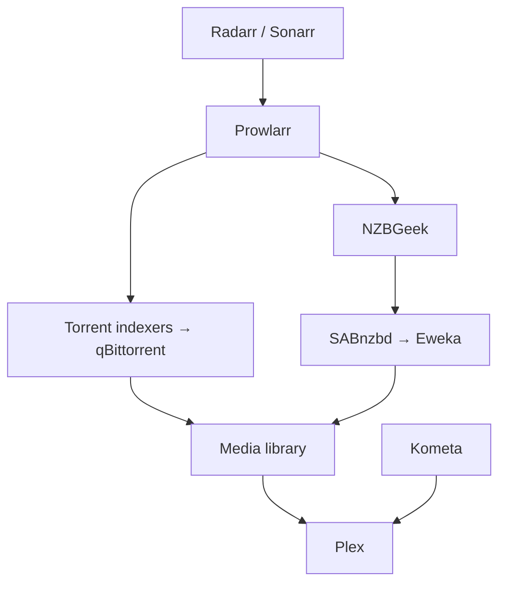

# Homelab Infrastructure

A documented migration from a working laptop-hosted media stack to a dedicated, headless Ubuntu Server platform.

The project is both a practical home infrastructure build and a public engineering portfolio. It focuses on reproducible deployment, storage safety, service recovery, honest status reporting, and incremental migration without losing the working source system.

## Project status

**Current phase:** source-stack freeze and desktop migration preparation.

- The active media stack still runs on the Ubuntu laptop and is now treated as a known-good frozen source.
- Plex, Radarr, Sonarr, Prowlarr, qBittorrent, Kometa, SABnzbd, Eweka, and NZBGeek have verified working integrations.
- Real movie and TV Usenet workflows have completed end to end through Plex.
- Fresh Radarr, Sonarr, and Prowlarr backups exist.
- A full private Docker-stack archive was created while services were stopped and was read-verified.
- The target desktop already runs Ubuntu Server with working SSH and Wi-Fi.
- The Toshiba MG09 18 TB disk is attached and undergoing acceptance testing before storage preparation.
- Final filesystem, mounts, permissions, and media-stack restoration on the desktop remain pending.

Status details and evidence boundaries are tracked in [Current state](docs/current-state.md).

## Architecture at a glance

The current source system uses Docker Compose to provide a local media-management pipeline:

See [Architecture](docs/architecture.md) for current and target boundaries.

## Documentation

| Document | Purpose |
|---|---|
| [Current state](docs/current-state.md) | Verified, planned, blocked, and unknown items |
| [Architecture](docs/architecture.md) | Current topology and target platform boundaries |
| [Hardware and storage](docs/hardware-and-storage.md) | Host inventory, disk evidence, and storage risks |
| [Media stack](docs/media-stack.md) | Services, paths, Plex/Kometa, torrent, Usenet, and freeze state |
| [Operations and recovery](docs/operations-and-recovery.md) | Safe checks, backups, recovery evidence, and risks |
| [Migration plan](docs/migration-plan.md) | Staged laptop-to-desktop migration and acceptance criteria |
| [Roadmap](docs/roadmap.md) | Now, next, blocked, later, and open decisions |
| [Security](docs/security.md) | Public-repository and operational safety rules |
| [ADR 001](docs/decisions/001-use-ubuntu-server-24-04-lts.md) | Ubuntu Server selection |

## Repository principles

- Keep the laptop state intact until the desktop passes acceptance checks.
- Separate confirmed implementation from plans and assumptions.
- Prefer read-only discovery before changing disks, filesystems, mounts, or services.
- Use persistent disk identifiers such as UUIDs; never depend on `/dev/sdX` naming.
- Restore the known-good stack before combining migration with upgrades or refactors.
- Treat storage capacity, redundancy, and backup as separate concerns.
- Never commit credentials, tokens, public IP addresses, private identifiers, disk serial numbers, or unsanitized configuration exports/backups.

## Near-term objective

Move the existing external source disk to the desktop, finish safe storage preparation, establish persistent mounts and permissions, restore the known-good Docker stack incrementally, and validate Plex, Usenet, torrent fallback, and Kometa before enabling post-migration improvements.

## Scope boundary

This repository documents verified infrastructure state and planned implementation. It does not claim that the desktop media stack, final storage layout, automated backups, monitoring, remote access, or post-migration automation are complete until evidence is added.
