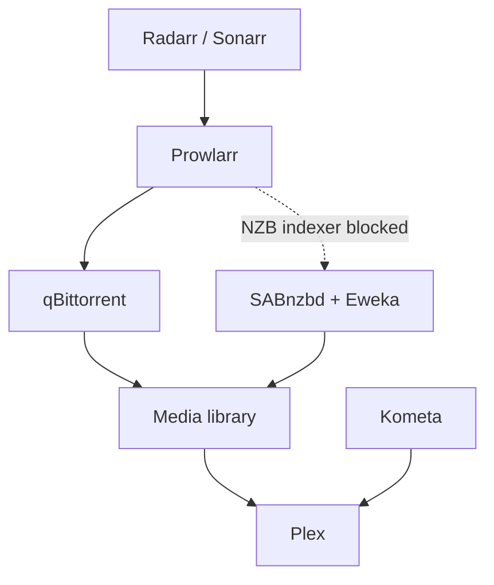

# Homelab Infrastructure

A documented migration from a working laptop-hosted media stack to a dedicated, headless Ubuntu Server platform.

The project is both a practical home infrastructure build and a public engineering portfolio. It focuses on reproducible deployment, storage safety, service recovery, honest status reporting, and incremental migration without losing the working source system.

## Project status

**Current phase:** hardware preparation and migration planning.

- The active stack still runs on an Ubuntu laptop.
- Plex, Radarr, Sonarr, Prowlarr, qBittorrent, Kometa, and SABnzbd have verified component-level functionality.
- Eweka connectivity and the Radarr/Sonarr connections to SABnzbd have been tested.
- The complete Usenet workflow is blocked until a working NZB indexer is available.
- The target desktop has not yet been installed or configured.
- A Toshiba MG09ACA18TE 18 TB disk has been acquired; local acceptance testing is pending.
- Ubuntu Server 24.04 LTS has been selected for the target platform.

Status details and evidence boundaries are tracked in [Current state](docs/current-state.md).

## Architecture at a glance

The current system uses Docker Compose to provide a local media-management pipeline:

See [Architecture](docs/architecture.md) for current and target boundaries.

## Documentation

| Document | Purpose |
|---|---|
| [Current state](docs/current-state.md) | Verified, planned, blocked, and unknown items |
| [Architecture](docs/architecture.md) | Current topology and target platform boundaries |
| [Hardware and storage](docs/hardware-and-storage.md) | Host inventory, disk evidence, and storage risks |
| [Media stack](docs/media-stack.md) | Services, paths, Plex/Kometa, torrent, and Usenet behavior |
| [Operations and recovery](docs/operations-and-recovery.md) | Safe checks, backups, recovery evidence, and risks |
| [Migration plan](docs/migration-plan.md) | Staged laptop-to-desktop migration and acceptance criteria |
| [Roadmap](docs/roadmap.md) | Now, next, blocked, later, and open decisions |
| [Security](docs/security.md) | Public-repository and operational safety rules |
| [ADR 001](docs/decisions/001-use-ubuntu-server-24-04-lts.md) | Ubuntu Server selection |

## Repository principles

- Keep the current laptop stack available until the target has passed acceptance checks.
- Separate confirmed implementation from plans and assumptions.
- Prefer read-only discovery before changing disks, filesystems, mounts, or services.
- Use persistent disk identifiers such as UUIDs; never depend on `/dev/sdX` naming.
- Treat storage capacity, redundancy, and backup as three different concerns.
- Never commit credentials, tokens, public IP addresses, private hostnames, disk serial numbers, or unsanitized configuration exports.

## Near-term objective

Build a safe target platform, verify both disks, install Ubuntu Server, establish persistent storage and SSH, deploy a low-risk pilot service, and then migrate the media stack incrementally with a tested rollback path.

## Scope boundary

This repository documents infrastructure state and planned implementation. It does not claim that target-server services, storage layouts, backup automation, monitoring, remote access, or full Usenet automation exist until evidence is added.

