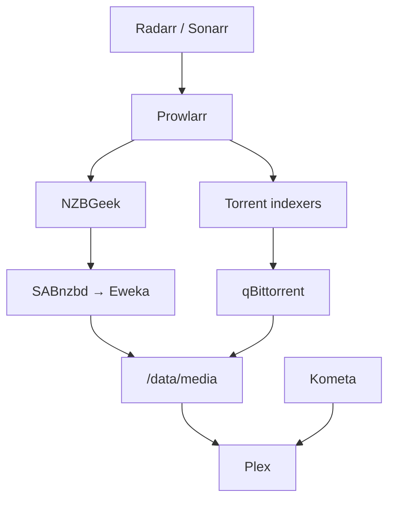

# Homelab Infrastructure

A documented migration from a working laptop-hosted media stack to a dedicated, headless Ubuntu Server platform.

The project is both a practical home infrastructure build and a public engineering portfolio. It focuses on reproducible deployment, storage safety, service recovery, honest status reporting, and incremental migration without losing the working source system.

## Project status

**Current phase:** desktop cutover complete; application validation and migration closure in progress.

- The media stack now runs on the dedicated Ubuntu Server desktop.
- The 18 TB Toshiba data disk is formatted as ext4 and mounted persistently at `/data`.
- Plex, Radarr, Sonarr, Prowlarr, qBittorrent, and SABnzbd are running successfully on the desktop.
- Migrated data and application state were validated with resumable copy checks and recovery-archive checksum comparison.
- A real Radarr post-migration download/import completed successfully.
- NTFS-era duplicate media/torrent payloads were converted to ext4 hardlinks, reclaiming roughly 711.6 GiB.
- Recyclarr now manages the main Radarr TRaSH quality profile.
- Automatic acquisition prefers Usenet; torrents remain manual/Interactive Search fallback.
- The old external source disk is still retained read-only as rollback media until final application validation is complete.
- A temporary Compose override pins known-good application versions so migration remains separated from upgrades.

Status details and evidence boundaries are tracked in [Current state](docs/current-state.md).

## Architecture at a glance

The automatic path is Usenet-first. Torrents remain an explicit fallback for Interactive Search and exceptional releases.

See [Architecture](docs/architecture.md) for current boundaries.

## Documentation

| Document | Purpose |
|---|---|
| [Current state](docs/current-state.md) | Verified, planned, blocked, and unknown items |
| [Architecture](docs/architecture.md) | Current topology and platform boundaries |
| [Hardware and storage](docs/hardware-and-storage.md) | Host inventory, disk evidence, and storage risks |
| [Media stack](docs/media-stack.md) | Services, paths, Plex/Kometa, torrent, Usenet, and media behavior |
| [Operations and recovery](docs/operations-and-recovery.md) | Safe checks, backups, recovery evidence, and risks |
| [Migration plan](docs/migration-plan.md) | Migration stages, validation, and closure criteria |
| [Desktop migration milestone](docs/migration-milestone-2026-09-01.md) | Evidence-backed desktop cutover milestone |
| [Roadmap](docs/roadmap.md) | Now, next, blocked, later, and open decisions |
| [Security](docs/security.md) | Public-repository and operational safety rules |
| [ADR 001](docs/decisions/001-use-ubuntu-server-24-04-lts.md) | Ubuntu Server selection |

## Repository principles

- Keep rollback media until the desktop passes final application acceptance.
- Separate confirmed implementation from plans and assumptions.
- Prefer read-only discovery before changing disks, filesystems, mounts, or services.
- Use persistent disk identifiers; never depend on `/dev/sdX` naming.
- Separate migration from upgrades and refactors.
- Treat storage capacity, redundancy, and backup as separate concerns.
- Never commit credentials, tokens, public IP addresses, private identifiers, disk serial numbers, or unsanitized configuration exports/backups.

## Near-term objective

Complete application-level validation on the desktop, then formally close the migration by retiring the old source disk, replacing the temporary migration-version override with a permanent update/pinning policy, and hardening backup and public-safe configuration.

## Scope boundary

This repository documents verified infrastructure state and planned implementation. It does not claim that automated off-host backups, monitoring, remote access, final update automation, or future storage expansion are complete until evidence is added.
