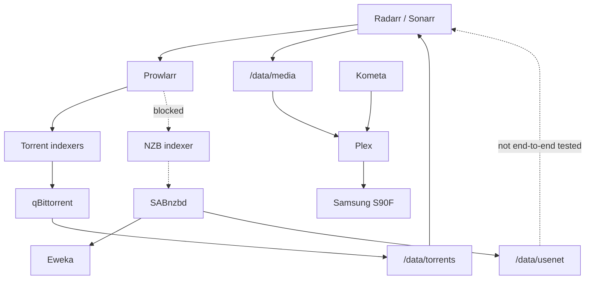
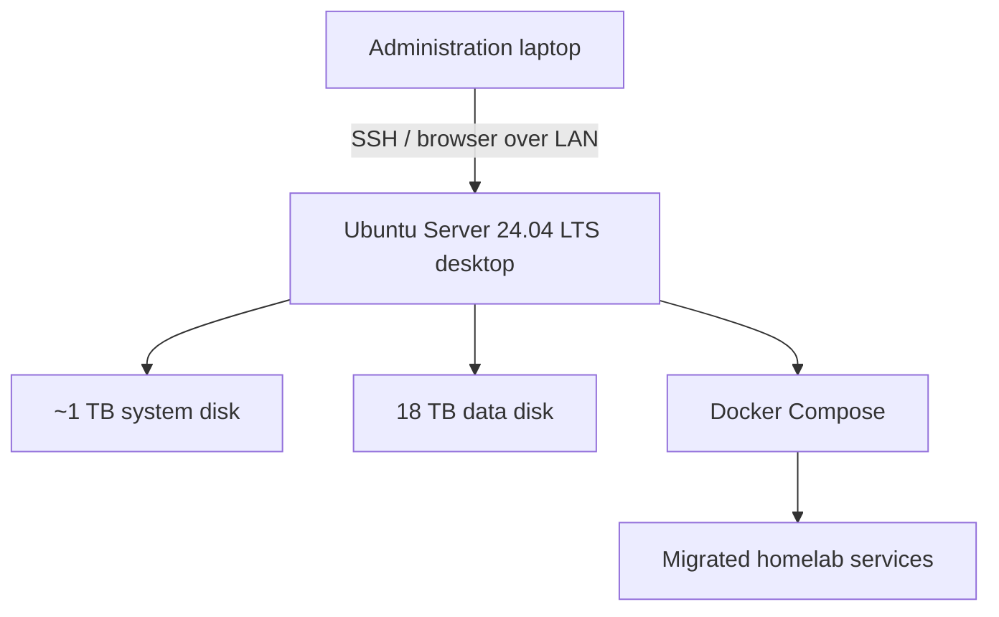

# Architecture

The project has two distinct platforms: the currently operational laptop and the planned desktop server. They must not be described as one deployed system until migration is complete.

## Current logical architecture

### Network model

- Plex uses host networking.
- The other services use the default Compose bridge unless later live inspection shows otherwise.
- Radarr and Sonarr reach SABnzbd using `sabnzbd:8080` inside the Compose network.
- SABnzbd is exposed on host port `8081`; qBittorrent uses host port `8080`.
- The SABnzbd hostname `sabnzbd` was added to its specific host whitelist after an internal `403 Forbidden` response.
- No public internet exposure, reverse proxy, or remote-access design is currently documented.

## Service endpoints

All addresses are placeholders and represent LAN-only access.

| Service | Endpoint |
|---|---|
| Plex | `http://<HOST_LAN_IP>:32400` |
| Radarr | `http://<HOST_LAN_IP>:7878` |
| Sonarr | `http://<HOST_LAN_IP>:8989` |
| Prowlarr | `http://<HOST_LAN_IP>:9696` |
| qBittorrent | `http://<HOST_LAN_IP>:8080` |
| SABnzbd | `http://<HOST_LAN_IP>:8081` |
| Kometa | No Web UI |

## Target platform boundary

This is a target design, not a representation of deployed infrastructure.

### Intended responsibility split

| Layer | Intended responsibility |
|---|---|
| System disk | Ubuntu, Docker, Compose, appdata, databases, metadata, and logs |
| Data disk | Media, downloads, and other bulk data |
| Docker Compose | Reproducible service definitions and persistent mounts |
| SSH | Normal headless administration |
| LAN | Initial service access; Ethernet is preferred long-term |

Final filesystems, mount paths, permissions, UID/GID strategy, Docker networks, and backup tooling remain open decisions.

