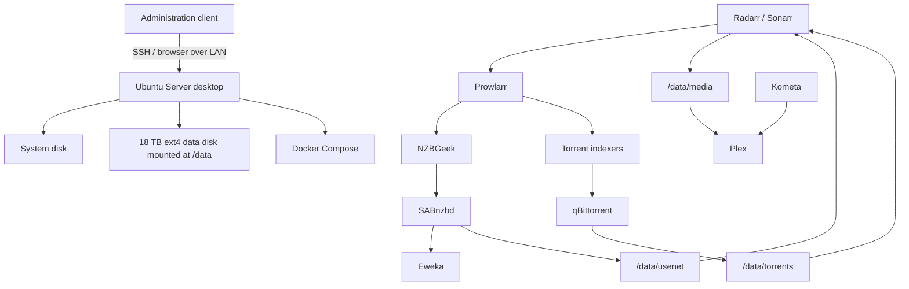

# Architecture

The dedicated Ubuntu Server desktop is now the operational homelab host. The previous notebook/external-disk environment is retained only as migration rollback material until final acceptance.

## Current architecture



## Acquisition policy

The automatic/default path is:

```text
Radarr / Sonarr
→ Prowlarr / NZBGeek
→ SABnzbd
→ Eweka
→ ARR import
→ Plex
```

Torrent indexers remain available for Interactive Search/manual fallback.

CZ/SK torrent sources are treated as manual exceptions unless future usage justifies more automation.

## Network model

- Plex uses host networking.
- Other media services use the Compose bridge.
- Service-to-service communication uses Docker DNS where appropriate.
- No public internet exposure or reverse proxy is documented.
- Wi-Fi is currently operational; Ethernet remains the preferred long-term transport.

## Storage model

```text
/data
├── arr_backup
├── docker
├── media
│   ├── movies
│   └── tv
├── torrents
└── usenet
```

The 18 TB data disk is ext4.

The old external NTFS disk remains a temporary rollback source only.

## Hardlink behavior

The old NTFS source did not provide the intended media/torrent hardlink behavior.

After migration to ext4, verified duplicate media/torrent payloads were converted to real hardlinks. Future ARR torrent imports are expected to use this filesystem capability directly.

## Application-version boundary

A temporary migration Compose override pins known-good application versions.

This preserves the architectural principle:

**migration first, upgrades later.**

The permanent image pin/update strategy remains a post-migration infrastructure decision.

## Media configuration layer

Recyclarr is deployed as a separate Compose project for reproducible TRaSH-based media quality configuration.

Radarr currently uses a single main UHD profile with 1080p fallback. Sonarr is intended to follow the same philosophy using Sonarr-specific TRaSH definitions.

## Remaining migration boundary

The architecture is operational on the desktop, but final closure still depends on media-application acceptance and retirement of the old rollback source.
