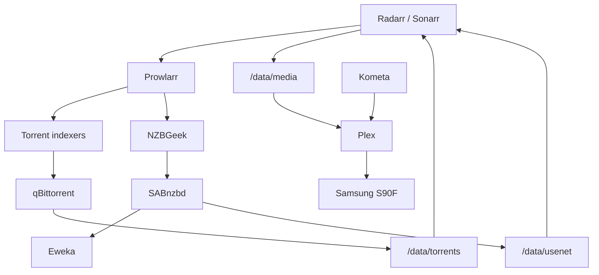
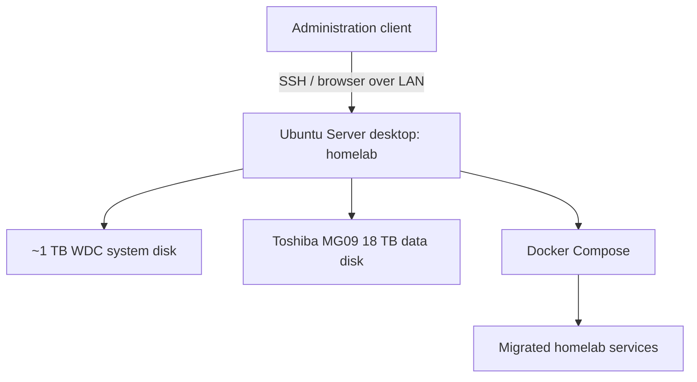

# Architecture

The project currently has two distinct platforms: a working laptop-hosted media stack and a dedicated desktop that has been prepared as the migration target. They must not be described as one production system until cutover is complete.

## Current source architecture

Both acquisition paths are verified. Torrents remain the fallback path; Usenet has been verified end to end for both Radarr and Sonarr.

### Network model

- Plex uses host networking.
- The other services use the Compose bridge unless later inspection shows otherwise.
- Radarr and Sonarr reach SABnzbd at `sabnzbd:8080`.
- Prowlarr reaches sibling ARR applications through Docker service DNS rather than `localhost`.
- SABnzbd is exposed on host port `8081`; qBittorrent uses host port `8080`.
- The specific Docker hostname `sabnzbd` is allowed by SABnzbd's host whitelist.
- No public internet exposure, reverse proxy, or remote-access design is documented.

## Service endpoints

All addresses are placeholders and represent LAN-only access.

| Service | Endpoint |
|---|---|
| Plex | `http://<HOST_LAN_IP>:32400` |
| Radarr | `http://<HOST_LAN_IP>:7878` |
| Sonarr | `http://<HOST_LAN_IP>:8989` |
| Prowlarr | `http://<HOST_LAN_IP>:9696` |
| qBittorrent | `http://<HOST_LAN_IP>:8080` |
| SABnzbd | `http://<HOST_LAN_IP>:8081` |
| Kometa | No Web UI |

## Target desktop platform

The target is no longer hypothetical: Ubuntu Server is installed, SSH works, Wi-Fi survives reboot, and the 18 TB disk is physically attached. The media stack itself has not yet been restored there.

### Intended responsibility split

| Layer | Intended responsibility |
|---|---|
| System disk | Ubuntu, Docker runtime, Compose and potentially appdata depending on final storage decision |
| 18 TB data disk | Bulk media/download storage after acceptance and filesystem preparation |
| Existing external disk | Migration source and temporary rollback/data source during cutover |
| Docker Compose | Reproducible service definitions and persistent mounts |
| SSH | Normal headless administration |
| LAN | Initial service access; Ethernet preferred long-term |

Final filesystems, mount paths, permissions, UID/GID strategy, Docker networks, and backup tooling remain open decisions.

## Migration boundary

The architectural goal during migration is **reproduction before redesign**. Preserve the existing logical `/data/...` paths where practical, restore known-good application state, validate acquisition and playback, and only then perform Compose cleanup, `.env` extraction, upgrades, monitoring, or additional automation.
